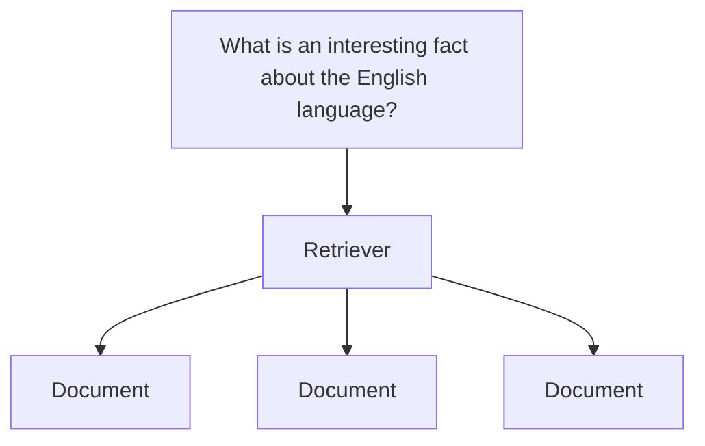
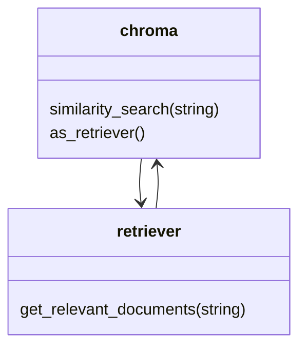
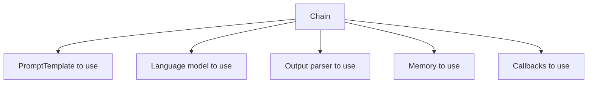

# Chatgpt and Langchain

## Index

Listed in order of study and complexity

- Simple examples:

  - [Simple OpenApi call](/simple_examples/00-simple-api-call.py)
  - [Creation of a chain](/simple_examples/01-simple-chain-args.py) with inputs/outputs and templates
  - [Chain multiple chains](/simple_examples/02-multiple-chains.py) using `SequentialChain` to chain multiples `LLMChain`

- Terminal Chat:
  - [File history persistence](/tchat/00-file-history.py). Use a file to persist conversations. Using `FileChatMessageHistory`
  - [Summary history](/tchat/01-summary-history.py), rather than persist all the
  conversation keep only the summary to save money. Use of
  `ConversationSummaryMemory`

- Facts: Feed our conversation with some facts as input and save them in vector
models after analysis and weighting(embeddings). The goal is:
   1. Create embedding out of the user's question
   2. Do a similarity search with our stored embeddings to find the ones most similar to the user's question
   3. Put the most relevant 1-3 facts into the prompt along with the user's question
  
  The code:

  - [Seed our database](/facts/playground.py), load the facts.txt and extract
  chuncks to be weihgted(embeddings) and storage using
  [chromadb](https://www.trychroma.com/) as vectorial database.
  - [Consult database](/facts/prompt_no_duplicates.py), create a retriver from our chroma
  database and pass it to `RetrievalQA` in order to run a
  chain(chat with model). Also it was created a `RedundantFilterRetriever` that
  avoids duplicated embeddings.
  - Created different chain types to feed our `RetrievalQA`:
        - [Map Reduce](/facts/prompt_map_reduce.py)
        - [Map Re-rank](/facts/prompt_map_rerank.py)
        - [Refine](/facts/prompt_refine.py)
        - [Stuff](/facts/prompt_stuff.py)
  - [Visualization](/facts/scores.ipynb): Draw a chart to see embeddings with a jupyter notebook.

## Requiriments

1. If you have not already done so, create a pycode directory somewhere on your development machine.
2. In your terminal run pip install pipenv or depending on your environment,

```shell
pyenv install 3.11.10
pyenv shell 3.11.10
python -V
pip install pipenv
```

3. Create a file in your pycode project directory called Pipfile
4. Copy paste the following code into that new Pipfile (or drag and drop the
file that is attached to this lecture into your pycode project directory)

```Pipfile
[[source]]
url = "https://pypi.org/simple"
verify_ssl = true
name = "pypi"
 
[packages]
langchain = "==0.0.352"
openai = "==0.27.8"
python-dotenv = "==1.0.0"
 
[dev-packages]
 
[requires]
python_version = "3.11"
```

5. Inside your pycode project directory, run the following command to install your dependencies from the Pipfile:

```shell
pipenv install
pipenv --venv # to verify the environment created
```

6. Run the following command to create and enter a new environment:

```shell
pipenv shell
```

After doing this your terminal will now be running commands in this new environment managed by Pipenv.

Once inside this shell, you can run Python commands just as shown in the lecture videos.

eg:

python main.py

7. If you make any changes to your environment variables or keys, you may find
that you need to exit the shell and re-enter using the pipenv shell command.

## How to install a new python library

Run the following command

```shell
pipenv install matplotlib
```

## Obtaining API Key

1. Open your browser and navigate to https://platform.openai.com/

2. Create an OpenAI account by logging in with an existing provider or by creating an account with your email address.

3. In the top menu click on `Dashboard` and then in the left menu click on `Api Keys`

4. Click in `Create new secret key`

5. put a name in this case `PyCode`, and copy the key generated since this key will be lost and not shown again.

## Terminology

LLM = Large Language Model.  Algorithm that generates text

### LLM models

Completion model: Large Language Model that tries to add text onto the end of a
prompt that you give it.

Chat model: Large Language Model designed for back-and-forth conversational
style text generation.

### LangChain

Library to provide interchangeable tools to automate each step of a text
generation. Has tools for loading data, parsing it, storing it, querying it,
passing it off to models like ChatGPT.
Integrates with a ton of different services provided by a ton of different
companies.

(Relatively) easy to swap out providers. Don't want to use ChatGPT anymore? Swap in a different model in a few minutes

LangChain refers to completion-based models as 'LLM's
LangChain refers to chat-based models as 'Chat Models'

#### Terminology

<!-- markdownlint-disable MD013 -->
| **OpenAI Terminology** | **LangChain Terminology** | **Definition**                                                                                    |
|------------------------|---------------------------|---------------------------------------------------------------------------------------------------|
| System Message         | System Message            | A message that gives some initial directions to the chat model, usually produced by developers.   |
| User Message           | Human Message             | A message produced by the user.                                                                   |
| Assistant Message      | AI Message                | A message produced by the chat model.                                                             |
<!-- markdownlint-enable MD013 -->

- from langchain.llms import OpenAI
give us an object that will use OpenApi's completion endpoint

- from langchain.chat_models import ChatOpenAI
give us an object that will use OpenApi's chat endpoint

#### Retriever

A retriever is an object that can take in a string and return some
relevant documents. To be a "Retriever", the object must have a method called
"get_relevant_documents" that takes a string and returns a list of documents



for example we did use chroma



> [!NOTE]
> To make a custom retriever, we can define a class that extends `BaseRetriever`.
> Our retriever must define `get_relevant_documents` and `aget_relevant`

#### Chain

A Chain is an object that specifies the template, language model, output parser, memory, and callbacks to use for text generation.

Why use Chains?

- Chains allow us to easily configure different parts without changing a lot of code.

- Multiple chains can also be connected together to create interesting and complex applications.

Chain Components:

- PromptTemplate to use The prompt format or structure that guides the model’s response.
- Language model to use The specific AI model used for generating responses.
- Output parser to use Processes and parses the output of the model.
- Memory to use Stores and retrieves contextual information for the chain.
- Callbacks to use Handles specific events or actions during the chain’s execution.



### File loaders by type

Some of this loaders may need to install extra packages

| File Type        | LangChain Loader Class        |
|------------------|-------------------------------|
| `facts.txt`      | `TextLoader`                  |
| `report.pdf`     | `PyPDFLoader`                 |
| `users.json`     | `JSONLoader`                  |
| `blog.md`        | `UnstructuredMarkdownLoader`  |
| assets buckets S3| `S3FileLoader`                |

### Embeddings Models

An embedding is a list of numbers between -1 and 1 that score how much a piece
of text is talking about some particular quality.
An embedding is used to understand the goal of the users search (semantic search)

- SentenceTransformer: all-mpnet-base-v2 768dimensions
- OpenAI Embeddings: 1536 dimensions calculate embeddings manually, we can use
the "embed_query" function (class `OpenAIEmbeddings)

### Chroma Vector Database

[chromadb](https://www.trychroma.com/) is a vectorial database that use
SQLite.

To find similar documents, we can use Chroma's `similarity_search()` function
If you want to find similarities to an embedding you already calculated, you can
use the `similarity_search_by_vector` function instead

Chroma can remove duplicates for us automatically using the
`max_marginal relevance_search_by_vector`

### Glosary

Vector database: Special database made for storing embeddings

### Glossary

**Vector database:** Special database made for storing embeddings

**Similarity:**

- **Squared L2:** Using the distance between two points to figure out how similar they are
- **Cosine similarity:** Using the angle between two vectors to figure out how similar they are

## Links

- [Discord comunnity](https://discord.gg/h2G3CbxPZA)
- [Playground](https://platform.openai.com/playground)
- [Json schema generator](transform.tools/json-to-json-schema)
